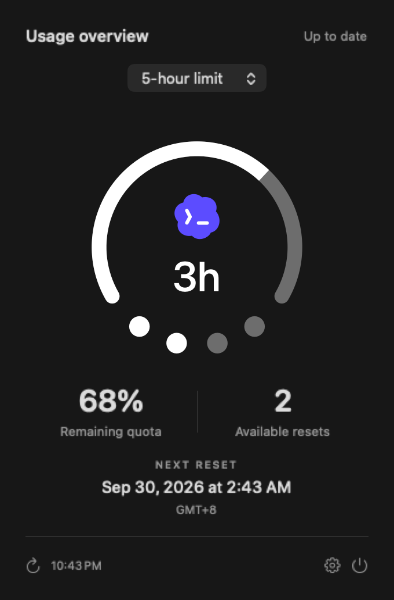

# Codex Buddy — native macOS menu bar ChatGPT / Codex usage monitor

English · [简体中文](README.md)

Track your remaining ChatGPT / Codex quota, usage limits, reset time, and available reset credits from the Mac menu bar. Codex Buddy is a lightweight native macOS utility built with AppKit, SwiftUI, and URLSession.

## Features

- Menu bar quota ring, reset countdown, and reset-credit dots.
- Click for usage details; dates follow system locale and time preferences.
- Optional launch at login and in-app update checks.
- No bundled Codex CLI, Electron runtime, analytics SDK, or persistent query subprocess.

## Interface preview

The visual design takes inspiration from the **iPhone Duo signal indicator**: an arc, countdown, and four dots combine remaining quota, reset time, and available reset credits in one menu bar icon.

### Menu bar and expanded panel




## Download and install

Download the arm64 DMG from [GitHub Releases](https://github.com/duoduocats/codex-buddy/releases/latest), then drag **Codex Buddy.app** into Applications.

Requires Apple Silicon and macOS 13 or later. Liquid Glass is used on macOS 26 or later. Current builds are ad hoc signed and are not Apple notarized. macOS may require approval under System Settings → Privacy & Security. Launch at login is off by default. The interface supports English and Simplified Chinese, following your macOS preferred language. You can set an app-specific language in System Settings; relaunch the app to apply it.

### If macOS blocks the first launch

1. Move the app into **Applications** and try opening it once.
2. If macOS says the developer cannot be verified or Apple cannot check the app for malicious software, dismiss the alert and open **System Settings → Privacy & Security**.
3. Scroll to **Security**, find the Codex Buddy notice, and click **Open Anyway**.
4. Confirm with Touch ID or an administrator password when prompted, then click **Open**.

Open Anyway is usually available for about an hour after the launch attempt. If it is missing, try opening the app again and revisit Settings. These steps apply to unidentified-developer/notarization alerts; stop installation if macOS explicitly detects malware. Download from this repository's Releases. See [Apple's instructions](https://support.apple.com/en-gb/102445).

## How it works

Sign in to ChatGPT / Codex on your Mac first. The app reads existing local authentication into memory and requests quota information from ChatGPT. No separate API key is required. It does not run model tasks, consume reset credits, read conversations, or upload source code.

Successful polling runs approximately once per minute. Failed requests back off to at most one scheduled attempt per 16 minutes. Manual refresh and wake can retry immediately. Offline results stay visible with a stale-data indicator. Missing reset-credit information is shown as unavailable.

The quota endpoint may change independently of this project. Intel Macs are not supported by the current release artifact.

## Privacy

Credentials are neither bundled nor sent to GitHub. GitHub receives update-check and download requests; ChatGPT receives authenticated quota requests. Network providers necessarily receive connection metadata such as IP addresses. See the bilingual [privacy policy](docs/PRIVACY.md).


## Build and test

Use macOS with Xcode Command Line Tools and an SDK supporting NSGlassEffectView (Xcode 26+ recommended).

```sh
bash scripts/test.sh
BUILD_DIR="$(mktemp -d /private/tmp/codex-buddy-build.XXXXXX)" bash build.sh
bash scripts/package.sh
```

[Development and releases](docs/WORKFLOW.md) · [Quality gates](docs/QUALITY.md) · [Security reporting](SECURITY.md)

## License

GPL-3.0-only. See [LICENSE](LICENSE) and [third-party notices](THIRD_PARTY_NOTICES.md).
