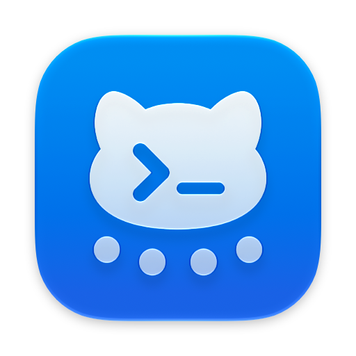
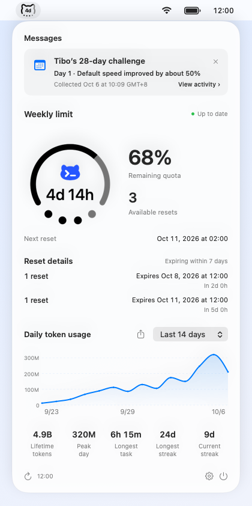
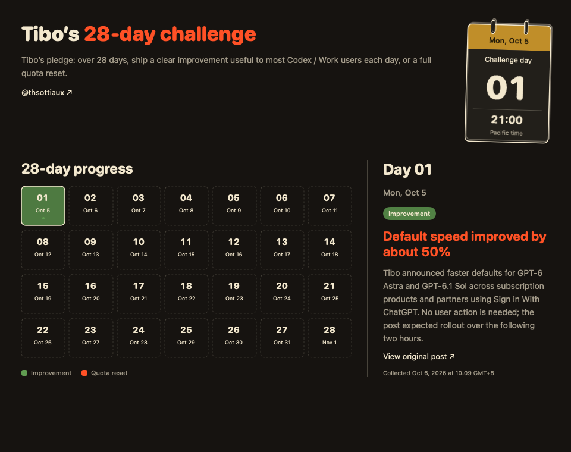

  

# Codex Buddy — macOS menu bar ChatGPT / Codex usage monitor

English · [简体中文](README.md) · [Download latest release](https://github.com/duoduocats/codex-buddy/releases/latest)

See your **remaining ChatGPT / Codex quota, reset countdown, and daily token usage** in the Mac menu bar. Click the icon to open quota details and a usage chart.

A native macOS utility for **Apple Silicon · macOS 13+**. It uses your existing local ChatGPT / Codex login; no separate API key is needed.

## DuoDuoCat

Choose **DuoDuoCat** or the classic Ring. See quota, a reset countdown, and available resets in one small icon. Switch themes in Settings at any time.

## Features

- **Quota at a glance:** choose Ring or DuoDuoCat, with a reset countdown or remaining percentage in the center. Four dots represent available resets when the service provides them.
- **Daily token chart:** view daily usage over 7, 14, or 30 days. If today’s record is not available yet, the chart ends yesterday; a reported zero still appears.
- **Five usage statistics:** lifetime tokens, peak daily tokens, longest task, longest streak, and current streak.
- **Share usage images:** turn the selected date range and statistics into an image to share, save, or copy through the system menu.
- **Messages and reset reminders:** receive announcements in the panel, with countdowns when an exact reset time is announced and optional system notifications.
- **Tibo’s 28-day challenge:** follow daily improvements and quota resets, select a day for details and original posts, and revisit records in Settings after the challenge ends.
- **In-app updates:** see your installed version and release notes, then download and install new versions within the app.
- **Your choice of display:** hide the daily usage section or sharing button, or enable launch at login.
- **English and Simplified Chinese:** the interface follows macOS preferred languages; reset dates follow your system time zone and 12 / 24-hour preferences.

Enable **Reset details** under **Panel** to see when your available resets expire. Choose **All** or **Upcoming**; upcoming details default to the next 7 days, with 1 / 3 / 7 / 14 / 30-day windows. Resets with the same expiration time are grouped together.

## Messages and updates

See quota-reset notices and other messages in the expanded panel, with times following your Mac’s time zone and regional format. When an exact reset time is officially announced, the message shows that time and a countdown; other messages show their publication time, or a clearly labelled collection time when the original time cannot be verified. Expired messages disappear. Click **×** to dismiss a message temporarily; it returns when you reopen the app if it is still valid.

Codex Buddy appears in the Dock while Settings or the activity window is open. Closing all windows hides its Dock icon and keeps the app running in the menu bar. Use the Settings sidebar to jump to a section. Under **Panel**, **Messages** controls receipt and display, with separate Reset reminders and Activity messages choices. **System alerts** independently pushes the same selected message types to macOS Notification Center. Turning off Messages stops receiving and push alerts, hides activity entries and closes the activity window.

The panel shows messages, quota, reset expiry details and daily tokens in that order. Use **View activity** on an activity message to open the full **Tibo’s 28-day challenge** progress. Challenge dates follow Pacific time; message timestamps follow your Mac’s time zone. After the challenge ends, use **General & updates → Activity records** in Settings to revisit it. System alerts follow your selected message types; disabling push keeps messages available in the panel.

Under **Messages**, turn **Reset reminders** and **Activity messages** on or off independently. Each type controls receiving, displaying and pushing its content. Turning off Activity messages also closes the activity window. Turning off the master disables both child controls while preserving their choices.

Click **Check for updates** in Settings to see new versions and release notes. When an update is available, use the **Download update** button beside Settings in the expanded panel to upgrade within the app.

Beta updates are off by default. Enable **Receive Beta updates** under **General & updates** to receive Beta releases. With it off, both automatic and manual checks use stable releases only.

## Download and install

1. Download and open the **arm64 DMG** from [GitHub Releases](https://github.com/duoduocats/codex-buddy/releases/latest).
2. Drag **Codex Buddy.app** into **Applications** on the right.
3. Open Codex Buddy from Applications and look for its menu bar icon. Make sure ChatGPT / Codex is already signed in on your Mac.

The DMG includes a drag-to-install background and an **[illustrated English and Chinese installation guide](docs/install/Installation-Guide.pdf)** for first-time users.

### If macOS cannot verify the developer

Current releases are ad hoc signed and are not Apple notarized. After confirming that the download came from this repository:

1. Try opening the app once, then dismiss the blocked-launch alert.
2. Open **System Settings → Privacy & Security**, scroll to the Codex Buddy notice, and click **Open Anyway**.
3. Complete the system confirmation, then click **Open**.

macOS saves the app as a security exception. These steps apply to developer-verification or notarization alerts. If macOS reports malware or a damaged file, stop and check the download. See [Apple's instructions](https://support.apple.com/en-us/102445).

## Default settings

| Setting | First-install default |
| --- | --- |
| Menu bar theme | DuoDuoCat; Ring is available |
| Menu bar display | Reset countdown; percentage is available |
| Daily token usage | On |
| Show sharing button | On |
| Messages | On |
| Reset reminders / Activity messages | Both on; each can be disabled |
| Show reset details | Off; choose All or Upcoming |
| System alerts | Off; enabling requests system notification permission |
| Launch at login | Off |

Upgrades preserve your settings. Turning off daily token usage hides the chart and statistics in the lower part of the panel.

## Lightweight and private

A native macOS app with a current download of about **2.8 MB**. It uses your existing local login to check quota, without reading conversations or project code. Usage images are created on your Mac; you choose when to save or share them.

See the [privacy policy](docs/PRIVACY.md).

## Frequently asked questions

### Which ChatGPT / Codex limits can I see?

Codex usage limits, remaining quota, the next reset time, and available resets provided for your signed-in account. If multiple quota windows are available, choose one in the expanded panel. Missing metrics show “—”. Token counts and quota percentages measure different things.

### Why is data unavailable after signing in?

Check that ChatGPT / Codex is signed in on your Mac, then click the panel's refresh button. If data is still unavailable, check your connection and try updating to the latest version.

### Why did I not receive a message notification?

Enable Messages and the desired types under Panel, enable System alerts and check **System Settings → Notifications → Codex Buddy**. Focus settings, an unavailable connection, quitting the app, or device sleep may affect notifications.

### Are Intel Macs supported?

The current release artifact supports Apple Silicon (arm64) only and requires macOS 13 or later.

### How do I change the interface language?

English and Simplified Chinese follow your macOS preferred language. You can also set an app-specific language in System Settings; relaunch the app to apply it.

## Feedback

Report a problem or suggest a feature in [GitHub Issues](https://github.com/duoduocats/codex-buddy/issues). For security concerns, see [Security reporting](SECURITY.md).

## License

[GPL-3.0-only](LICENSE).
