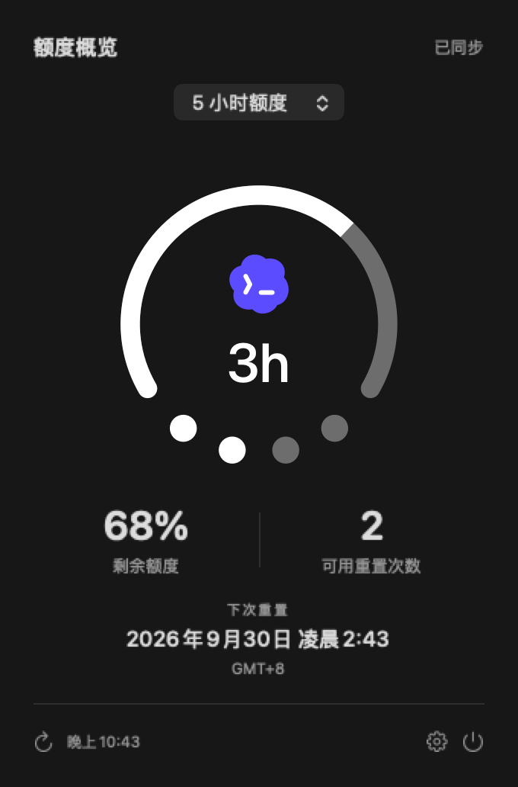

# Codex Buddy — macOS ChatGPT / Codex 额度监控

[English](README.en.md) · 简体中文

轻量原生 macOS 顶栏工具：查看本机 ChatGPT / Codex 的剩余额度、重置时间与可用重置次数。

- 原生 AppKit / SwiftUI / URLSession，无内置 CLI、无常驻查询子进程。
- Apple Silicon，macOS 13+；macOS 26+ 使用 Liquid Glass 面板。
- 顶栏图标显示额度、倒计时和四个重置次数圆点；点击查看详情。
- 设置仅提供开机启动、版本与检查更新。
- GPL-3.0-only；应用标识 `com.duoduocat.codexbuddy`。

## 界面预览

视觉样式借鉴 **iPhone Duo 信号栏**：用圆弧、倒计时和四个圆点，在一个顶栏图标中呈现剩余额度、重置时间和可用重置次数。

### 顶栏与展开面板




## 安装

从 [GitHub Releases](https://github.com/duoduocats/codex-buddy/releases/latest) 下载 DMG，将 Codex Buddy.app 拖入 Applications 后打开。
当前版本使用 ad hoc 签名，未经过 Apple 公证。若系统阻止打开，可在“系统设置 → 隐私与安全性”按提示允许。
首次安装后不会自动开启开机启动，请按需要在设置中打开。

### 首次打开被 macOS 拦截时

1. 将应用拖入 **Applications（应用程序）**，尝试打开一次。
2. 若提示“无法验证开发者”或“Apple 无法检查其是否包含恶意软件”，关闭提示，打开 **系统设置 → 隐私与安全性**。
3. 滚动到“安全性”，找到 Codex Buddy 的拦截提示，点击 **仍要打开**。
4. 按系统提示使用 Touch ID 或管理员密码确认，再点击 **打开**。

“仍要打开”通常在尝试启动后约一小时内出现；看不到时，重新尝试打开应用再查看设置。以上适用于开发者身份/公证提示；若系统明确报告恶意软件，请停止安装。请从本仓库 Releases 下载。参见 [Apple 官方放行说明](https://support.apple.com/en-gb/102445)。


## 使用与隐私

先在本机 ChatGPT / Codex 登录账号。应用在内存读取 `~/.codex/auth.json` 或 `CODEX_HOME` 中的既有登录状态，仅向 ChatGPT 额度接口查询，不运行模型任务或消耗重置次数。
不保存或打包凭据、不修改登录文件、不跟随额度接口重定向。凭据过期时请在 Codex 更新登录状态。
正常情况下额度约每分钟刷新，失败时逐步退避至 16 分钟，手动刷新和唤醒可立即重试；离线保留最后一次成功结果并提示待更新。
重置日期按系统时区、语言及 12/24 小时设置显示。无次数数据时显示“—”。


## 本机开发

需要 macOS 和 Xcode Command Line Tools（构建 SDK 须支持 NSGlassEffectView，推荐 Xcode 26+）。

```sh
bash scripts/test.sh
BUILD_DIR="$(mktemp -d /private/tmp/codex-buddy-build.XXXXXX)" bash build.sh
bash scripts/package.sh
```

[开发与发布流程](docs/WORKFLOW.md) · [发布记录](releases/) · [第三方说明](THIRD_PARTY_NOTICES.md)


## 常见问题

### Codex Buddy 能查看哪些 ChatGPT / Codex 额度？
在 Mac 菜单栏查看 Codex 使用限额、剩余额度、下次重置时间，以及接口提供的可用重置次数。未返回的数据不会伪造。

### 是否需要 API Key？
不需要另填 API Key，使用本机 ChatGPT / Codex 已有的登录状态。界面支持简体中文和英文，跟随 macOS 首选语言；可在系统设置中单独设置应用语言，重新打开应用后生效。

### 会上传聊天记录吗？
不会读取聊天记录或项目内容。额度请求发往 ChatGPT；检查更新和下载发往 GitHub。它们会收到建立连接所需的网络信息，例如 IP 地址。详见 [隐私说明](docs/PRIVACY.md)。

### 支持 Intel Mac 吗？
当前发布包仅支持 Apple Silicon（arm64）。额度接口不是本项目能保证长期稳定的公共 API，服务变化可能需要更新客户端。

[质量与发布检查](docs/QUALITY.md) · [安全反馈](SECURITY.md)
