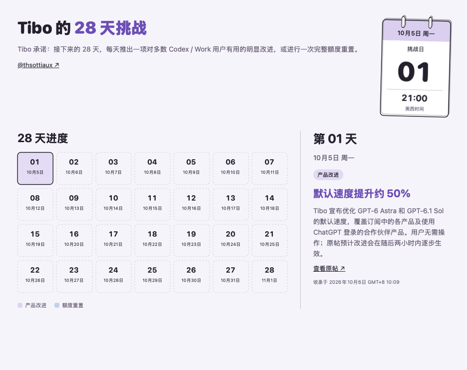

  

# Codex Buddy — macOS ChatGPT / Codex 额度监控

简体中文 · [English](README.en.md) · [下载正式版](https://github.com/duoduocats/codex-buddy/releases/latest) · [体验 2.5 Beta](https://github.com/duoduocats/codex-buddy/releases/tag/v2.5.0-beta.1)

在 Mac 菜单栏查看 **ChatGPT / Codex 剩余额度、重置倒计时和每日 Token 用量**。点击顶栏图标，即可展开额度详情与用量曲线。

原生 macOS 小工具，支持 **Apple Silicon · macOS 13+**。使用本机已有的 ChatGPT / Codex 登录状态，无需另填 API Key。

主面板重构与宠物功能现已进入 **2.5 Beta**。已有用户可在通用页开启 **接收 Beta 更新** 后检查，或从上方 Beta 链接安装。

## 多多猫 DuoDuoCat

选择 **多多猫** 或经典圆环。在一个小图标里查看额度、重置倒计时和可用重置次数，可在设置中随时切换主题。

## 主要功能

- **额度一眼可见**：圆环或多多猫显示剩余额度，中央可选重置倒计时或百分比；四个圆点表示可用重置次数。
- **每日 Token 用量**：查看近 7 / 14 / 30 天的每日用量。当日尚未生成记录时曲线截止到昨天；真实 0 用量仍会显示。
- **五项使用统计**：累计 Token、单日峰值、最长任务、最长连续和当前连续使用天数。
- **用量图片分享**：将所选日期范围的曲线和统计生成图片，通过系统菜单分享、保存或复制。
- **消息与重置提醒**：在展开面板接收公告；有准确预计重置时间时显示倒计时，可选择开启系统提醒。
- **用量概览与即时预览**：围绕顶栏和展开面板预览调整外观，开关即时生效。
- **Tibo 的 28 天挑战**：从消息页的悬浮入口查看每日产品改进与额度重置记录；结束后入口转为历史活动，可继续回看。
- **Codex 社区宠物**：浏览、搜索和收藏主题，预览完整动作，安装或卸载本机宠物，管理公开来源。
- **应用内更新**：在通用页查看当前版本与更新说明，直接下载并安装新版本。
- **按需显示**：可隐藏每日用量区域或分享按钮，也可开启开机启动。
- **中英文界面**：跟随 macOS 首选语言，重置日期和时间遵循系统时区及 12 / 24 小时设置。

在 **用量概览** 中开启 **重置明细**，可查看可用重置的到期时间。展示范围可选 **全部** 或 **最近到期**；最近到期默认显示未来 7 天内的记录，可选 1 / 3 / 7 / 14 / 30 天，相同时间到期的重置合并显示。预览使用示例数据，实际面板仍显示你的账号用量。

## 消息与更新

展开面板可查看额度重置预告等消息，时间跟随本机时区及日期格式。官方提供准确预计重置时间时，可查看预计时间和倒计时；其他消息显示发布时间，原帖时间无法核实时则明确显示收录时间。消息过期后自动隐藏。点击 **×** 可临时收起；重新打开应用后，仍有效的消息会再次显示。

打开主面板或活动窗口时，Dock 会显示 Codex Buddy 图标；关闭所有窗口后图标自动隐藏，应用继续在顶栏运行。左侧分为 **用量概览、宠物、消息、通用**。用量概览中的 **消息通知** 控制接收与显示，可分别选择 **重置提醒** 和 **活动消息**；通用页中的 **系统提醒** 控制向 macOS 通知中心推送相同的所选内容。关闭消息通知后，不再接收或推送消息，活动入口同时隐藏，已打开的活动窗口也会关闭。

下拉面板依次显示消息、额度、重置明细和每日 Token 用量。**消息** 页按时间排列最近公告，可滚动查看；在下拉面板中临时隐藏或已结束展示的消息仍保留在列表中。点击消息页标题区的 **特别活动** 悬浮台历，即可查看 **Tibo 的 28 天挑战**；结束后入口变为 **历史活动**，记录继续保留。挑战日期按美西时间计算，消息时间按本机时区显示。系统提醒按照消息类型选择推送，关闭推送仍可查看消息。

“消息通知”下的 **重置提醒** 和 **活动消息** 可分别关闭。关闭任一消息类型，会停止获取、隐藏该类消息并停止相关推送；关闭活动消息还会关闭活动窗口。总开关关闭时，两个子开关不可用，但会保留各自的选择。

活动期间，消息与活动记录每 5 分钟检查更新。打开活动窗口或网络恢复时会及时补查；读取失败会自动重试，并保留已有记录。

在 **通用** 页点击 **检查更新**，可查看新版本和更新说明。有可用更新时，点击展开面板中设置按钮旁的 **下载更新** 按钮，即可在应用内完成升级。

Beta 更新开关默认关闭，位于 **通用** 页。开启后可接收 Beta 测试版更新；关闭时，自动和手动检查都只接收正式版。关闭 Beta 后不会自动降级；已安装较新测试版时，会等待更高版本的正式版。

设置中会显示最近成功检查更新的时间。暂时断网会自动重试；更新失败时保留可用版本。

## 下载与首次安装

1. 从 [GitHub Releases](https://github.com/duoduocats/codex-buddy/releases/latest) 下载 **arm64 DMG** 并打开。
2. 将 **Codex Buddy.app** 拖入右侧的 **Applications（应用程序）**。
3. 从应用程序目录打开 Codex Buddy，在菜单栏查看额度。先确保本机 ChatGPT / Codex 已登录。

安装包内提供拖拽安装背景和 **[中英文图文安装指南](docs/install/Installation-Guide.pdf)**，首次安装可直接查看。

### macOS 提示无法验证开发者时

当前发布包使用 ad hoc 签名，尚未经过 Apple 公证。确认安装包来自本仓库后：

1. 尝试打开应用一次，关闭拦截提示。
2. 打开 **系统设置 → 隐私与安全性**，向下找到 Codex Buddy 的提示，点击 **仍要打开**。
3. 按系统提示完成确认，再点击 **打开**。

该应用会被保存为安全性例外。以上适用于开发者身份或公证提示；若系统报告恶意软件或文件损坏，请停止安装并重新检查下载来源。步骤依据 [Apple 官方说明](https://support.apple.com/zh-cn/102445)。

## Codex 宠物

在左侧 **宠物** 页浏览社区主题，搜索宠物或作者，预览动作并收藏喜欢的主题。顶部可切换 **发现、收藏、已安装、来源**，也可添加兼容的公开 HTTPS 目录。

选择主题后点击 **安装到本机**，核对作者、授权和目标目录后确认。安装完成后打开 Codex 设置，手动进入 **虚拟宠物**，刷新并选择使用。已安装页支持将主题移到废纸篓；覆盖安装会保留恢复副本。

Buddy 与独立 Codex Pets 的收藏、来源设置及缓存各自保存，两边可识别同一个 Codex 宠物目录。社区素材按需加载，不包含在应用包中。

## 默认设置

| 设置 | 首次安装默认值 |
| --- | --- |
| 顶栏主题 | 多多猫，可切换圆环 |
| 顶栏显示内容 | 重置倒计时，可切换百分比 |
| 每日 Token 用量 | 开启 |
| 显示分享按钮 | 开启 |
| 消息通知 | 开启 |
| 重置提醒 / 活动消息 | 均开启，可独立关闭 |
| 显示重置明细 | 关闭，可选择全部或最近到期 |
| 系统提醒 | 关闭，主动开启时申请系统提醒权限 |
| 开机启动 | 关闭 |

升级会保留已有设置。关闭每日 Token 用量后，展开面板隐藏下半部分的曲线和统计。

## 轻量与隐私

原生 macOS 应用，正式版安装包约 **2.8 MB**，2.5 Beta 约 **3.3 MB**。使用本机已有的登录状态查询额度，不读取聊天内容或项目代码。用量图片在本机生成，由你选择保存或分享。

详见 [隐私说明](docs/PRIVACY.md)。

## 常见问题

### 能查看哪些 ChatGPT / Codex 额度？

显示当前登录账号的 Codex 使用限额、剩余额度、下次重置时间及可用重置次数；若有多个额度窗口，可在展开面板中切换。暂不可用的数据显示“—”。Token 用量与额度消耗百分比是不同指标。

### 登录后仍然没有数据？

在本机 ChatGPT / Codex 中确认登录状态，再点击面板的刷新按钮。若仍无数据，请检查网络并尝试更新到最新版。

### 为什么没有收到消息通知？

先在展开面板设置开启消息通知并选择要接收的类型，开启系统提醒，然后检查 **系统设置 → 通知 → Codex Buddy**。专注模式、网络不可用、应用退出或设备休眠可能影响通知。

### 支持 Intel Mac 吗？

当前发布包仅支持 Apple Silicon（arm64），最低系统为 macOS 13。

### 如何切换界面语言？

支持简体中文和英文，默认跟随 macOS 首选语言。也可在系统设置中单独设置应用语言，重新打开应用后生效。

## 反馈

遇到问题或有功能建议，请在 [GitHub Issues](https://github.com/duoduocats/codex-buddy/issues) 留言。安全问题请参阅 [安全反馈](SECURITY.md)。

## 许可证

[GPL-3.0-only](LICENSE)。
