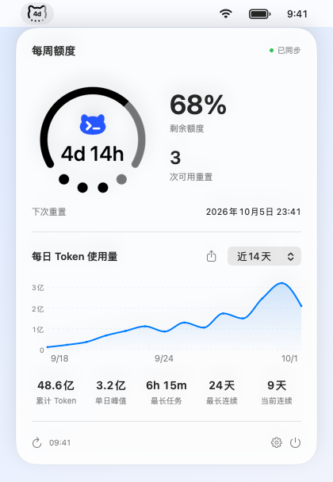

# Codex Buddy — macOS ChatGPT / Codex 额度监控

简体中文 · [English](README.en.md) · [下载最新版](https://github.com/duoduocats/codex-buddy/releases/latest)

在 Mac 菜单栏查看 **ChatGPT / Codex 剩余额度、重置倒计时和每日 Token 用量**。点击顶栏图标，即可展开额度详情与用量曲线。

原生 macOS 小工具，支持 **Apple Silicon · macOS 13+**。使用本机已有的 ChatGPT / Codex 登录状态，无需另填 API Key。

## 2.1 新增：消息提醒

展开面板以一行显示维护者发布的消息，例如 ChatGPT / Codex 全球重置通知。有截止时间的消息显示倒计时；× 只在本次运行隐藏，重启后未过期的消息重新显示，已到截止时间或过期的消息不再显示。

设置只保留 **消息提醒** 开关，主动开启并允许 macOS 通知后，接收新消息的系统通知。没有提前提醒或到点弹窗。消息从本仓库的公共文件读取，运行期间约每 15 分钟检查一次，遵循系统通知与专注模式设置。

**不增加版本统计上报。** 维护者可查看 GitHub 公开安装包下载次数；它不能识别用户或反映当前活跃版本分布，见 [版本下载统计](docs/VERSION-STATS.md)。

重大更新在设置按钮旁显示圆形 **下载更新** 按钮，不再自动弹窗；更新说明与下载状态放在设置中。

## 2.0 新增：多多猫 DuoDuoCat

保留经典圆环主题，新增 **多多猫** 顶栏主题：圆润的猫头轮廓、沿扁弧排列的四个圆点，将额度与重置状态融入一个小图标。可在设置中随时切换。



视觉设计借鉴 **iPhone Duo 信号栏样式**，把额度、倒计时和重置次数放进同一个顶栏图标。

## 主要功能

- **额度一眼可见**：圆环或多多猫显示剩余额度，中央可选重置倒计时或百分比；四个圆点表示接口提供的可用重置次数。
- **每日 Token 用量**：查看近 7 / 14 / 30 天的平滑曲线；已有每日历史中的空缺日期按 0 绘制。
- **五项使用统计**：累计 Token、单日峰值、最长任务、最长连续和当前连续使用天数，在一行内对齐。
- **用量图片分享**：将所选日期范围的曲线和统计生成图片，通过系统菜单分享、保存或复制。
- **消息提醒**：一行显示消息，可附倒计时并临时关闭；系统通知由用户主动开启。
- **按需显示**：可隐藏每日用量区域或分享按钮；支持开机启动与应用内检查更新。
- **中英文界面**：跟随 macOS 首选语言，重置日期和时间遵循系统时区及 12 / 24 小时设置。macOS 26+ 使用 Liquid Glass 面板。

## 下载与首次安装

1. 从 [GitHub Releases](https://github.com/duoduocats/codex-buddy/releases/latest) 下载 **arm64 DMG** 并打开。
2. 将 **Codex Buddy.app** 拖入右侧的 **Applications（应用程序）**。
3. 从应用程序目录打开 Codex Buddy，在菜单栏查看额度。先确保本机 ChatGPT / Codex 已登录。

安装包内提供拖拽安装背景和 **[中英文图文安装指南](docs/install/Installation-Guide.pdf)**，首次安装可直接查看。

### macOS 提示无法验证开发者时

当前发布包使用 ad hoc 签名，尚未经过 Apple 公证。确认安装包来自本仓库后：

1. 尝试打开应用一次，关闭拦截提示。
2. 打开 **系统设置 → 隐私与安全性**，向下找到 Codex Buddy 的提示，点击 **仍要打开**。
3. 按系统提示完成确认，再点击 **打开**。

该应用会被保存为安全性例外。以上适用于开发者身份或公证提示；若系统报告恶意软件或文件损坏，请停止安装并重新检查下载来源。步骤依据 [Apple 官方说明](https://support.apple.com/zh-cn/102445)。

## 默认设置

| 设置 | 首次安装默认值 |
| --- | --- |
| 顶栏主题 | 圆环，可切换多多猫 |
| 顶栏显示内容 | 重置倒计时，可切换百分比 |
| 每日 Token 用量 | 开启 |
| 用量分享按钮 | 开启 |
| 消息提醒 | 关闭，主动开启时申请系统通知权限 |
| 开机启动 | 关闭 |

升级会保留已有设置。关闭每日 Token 用量后，展开面板隐藏下半部分的曲线和统计。

## 原生实现与隐私

**2.0 版本本机测试**：空闲平均 CPU **0.09–0.24%**，应用约 **1.89 MB**，含双语指南的 DMG 约 **1.69 MB**。性能数据使用演示数据，压力测试与范围见 [测试记录](docs/QUALITY.md)。

采用 **AppKit、SwiftUI、Charts 与 URLSession**，不内置 Codex CLI 或 Electron，也没有常驻查询子进程。额度约每分钟查询一次，失败时逐步延长间隔；离线保留上次结果并标记数据待更新。每日统计仅在用量区域可见时定期查询，使用五分钟内存缓存。

本机登录凭据仅用于向 ChatGPT 查询额度和使用统计，不打包进应用，也不发送给 GitHub。应用不读取聊天记录、项目代码或浏览器数据，不包含分析或广告 SDK。额度和统计保留在内存，用量图片在本机按需生成。

检查更新、下载和公告读取连接 GitHub；额度请求连接 ChatGPT。公告请求不附加登录凭据、Cookie、设备标识或版本统计参数；相关服务仍会收到连接所需的网络信息。详见 [隐私说明](docs/PRIVACY.md) 和 [质量与性能检查](docs/QUALITY.md)。

## 常见问题

### 能查看哪些 ChatGPT / Codex 额度？

显示当前登录账号的 Codex 使用限额、剩余额度、下次重置时间及接口提供的重置次数；若有多个额度窗口，可在展开面板中切换。接口未提供的数据显示“—”。Token 用量与额度消耗百分比是不同指标。

### 登录后仍然没有数据？

在本机 ChatGPT / Codex 中刷新登录状态，再点击面板的刷新按钮。每日历史暂不可用时显示暂无数据。服务接口可能变化，需要更新客户端。

### 为什么没有收到消息通知？

先在应用设置开启消息提醒，再检查系统设置 → 通知 → Codex Buddy。专注模式、网络不可用、应用退出和设备休眠可能影响新消息的发现或显示。没有有效消息时不显示消息行；同一条消息的同一修订版本只通知一次。

### 支持 Intel Mac 吗？

当前发布包仅支持 Apple Silicon（arm64），最低系统为 macOS 13。

### 如何切换界面语言？

支持简体中文和英文，默认跟随 macOS 首选语言。也可在系统设置中单独设置应用语言，重新打开应用后生效。

## 本机开发

需要 macOS 和 Xcode Command Line Tools；构建 SDK 须支持 `NSGlassEffectView`，推荐 Xcode 26+。

先按 [安装包构建说明](docs/install/README.md) 配置测试和打包所需的 Python 依赖；这些依赖不会进入应用。

```sh
bash scripts/test.sh
BUILD_DIR="$(mktemp -d /private/tmp/codex-buddy-build.XXXXXX)" bash build.sh
bash scripts/package.sh
```

[开发与发布流程](docs/WORKFLOW.md) · [安全反馈](SECURITY.md) · [第三方说明](THIRD_PARTY_NOTICES.md)

## 许可证

[GPL-3.0-only](LICENSE)。应用标识：`com.duoduocat.codexbuddy`。
